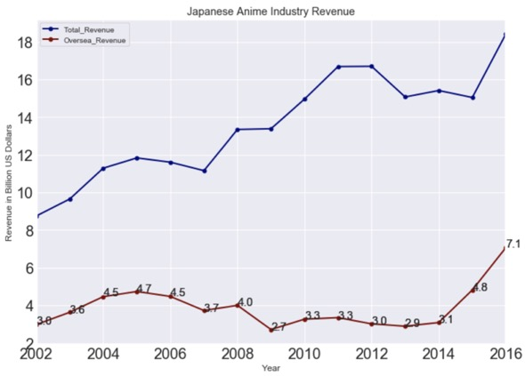
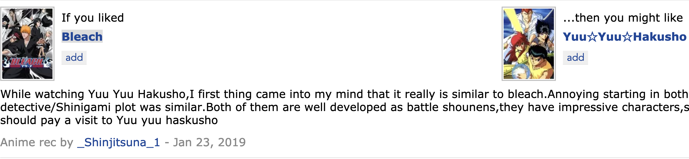
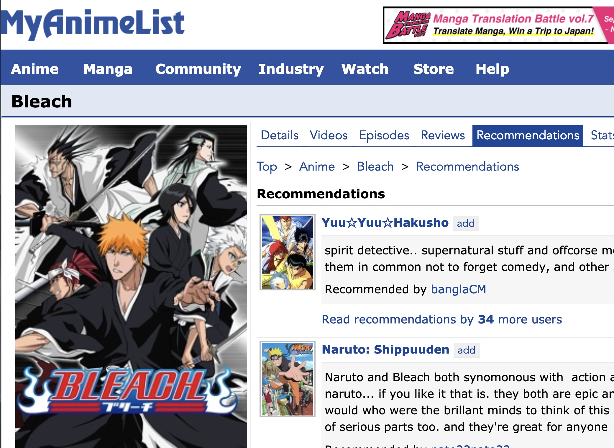

# Ani4me
## General Introduction
Ani4me is a personalized anime recommendation system for both existing and new anime fans, ani4me.

Anime industry is definitely growing.  In 2016, total revenue hit a new record of 18 billion dollars, and its oversea revenue reached 7.1 billion dollars following three consecutive years of growth. In fact, both viewer market and anime production are growing. Therefore, a hybrid model that can give precise personalized recommendations and handle cold start cases at the same time is in great need. Hence, its monetization strategy is straightforward.

## Hybrid Recommender

There are two conventional types of recommenders :collaborative filtering and content-based. They both have their pros and cons. The hybrid model combines them together into one stronger.

Documentation can be found here (https://lyst.github.io/lightfm/docs/home.html)

Now,I am going to explain the algorithm at a high level.
Let’s start from pure collaborative filtering method.
One way of doing pure CF is via matrix factorization. Basically, we factorize the rating matrix into items embeddings times users embeddings.

Hybrid recommender is factorization with a twist. First, each user is written as a linear combination of all of her user features. Each item as a linear combination of all of its features. For each unique feature we use factorization to get feature embeddings.  and we also allow for item-specific bias and user-specific bias here.

I also found a way to validate the content-based aspect of my hybrid model. Here is how.
On MAL (myanimelist.net), users can opt to give content-based paired recommendations. For example, this user recommended that if you like bleach you might also like yuu yuu haskusho.

MAL integrates this information and put it under the tab named recommendations for each anime.

